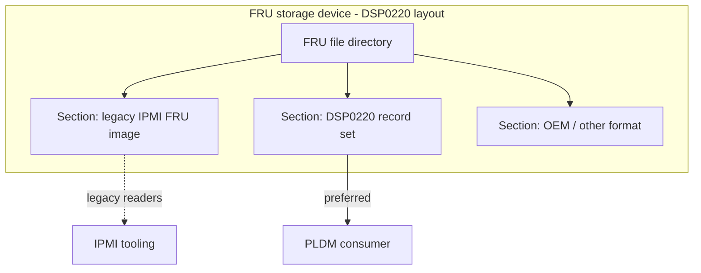

# IPMI FRU Manufacturing-Date Rollover — Problem & Proposed Fix 

## 1. Summary

The IPMI Platform Management FRU Information Storage format encodes the Board-area **Mfg Date/Time** as a **3-byte (24-bit) little-endian count of minutes since 00:00 UTC on 1996-01-01** (the value `0x000000` means "unspecified").

The field is 24 bits wide, which will overflow on Nov 24, 2027. The overflow will cause the field to wrap back to `0`.

```
2^24 - 1 = 16,777,215 minutes ≈ 31.9 years
1996-01-01 + 31.9 yr ≈ 2027-11-24
```

So on/after **~November 2027** any board manufactured then encodes a Mfg Date that a naive reader decodes as a date back near **1996**. This is a Y2K38-class bug with a different width/epoch (24 bits of minutes from 1996 instead of 31 bits of seconds from 1970). With the current date (2026), the rollover is imminent (~16 months out).


## 2. Current State (OpenBMC workaround)

OpenBMC change **[87782](https://gerrit.openbmc.org/c/openbmc/entity-manager/+/87782)** — *"fru-device: handle IPMI manufacturing rollover"* (MERGED 2026-04-15) — solves it on the **decode** side with a demarcation-date heuristic:

> Define a demarcation date of **1/1/2006**; any decoded date earlier than that is treated as being *after* the 2027 rollover, and one rollover period is added back.

Effectively:

```c
if (decoded_date < 2006-01-01)
    decoded_date += 2^24 minutes;   // ~31.9 years
```

This is a temporary, format-preserving workaround to ensure BMCs can obtain the correct date from IPMI FRU. However, even if this additional logic is always applied, the workaround itself will break starting **1/1/2036**.


## 3. DSP0220 - DMTF Field Replaceable Unit (FRU) Data Format Specification

Given that IPMI FRU is no longer maintained ([IPMI homepage](https://www.intel.com/content/www/us/en/products/docs/servers/ipmi/ipmi-home.html)), DMTF introduced DSP0220 as an extensible layout that enables a backward-compatible transition away from IPMI FRU over time. At a high level, DSP0220 defines a storage format that lets legacy IPMI FRU commands keep working while adding a new, more extensible format. The following section explains how this is achieved through the storage layout. The intent is to give older BMCs (using the OpenBMC workaround) that support only IPMI FRU a path to keep working unmodified, while at the same time adding support for newer BMC code that uses DSP0257 — allowing both to be served simultaneously by the GPU.

### 3.1 DSP0220 - Storage layout compatible with IPMI FRU

**DSP0220** (v1.0.1, 2025) defines how FRU data is *laid out at rest* in the storage device, and explicitly provides for **co-existence with the legacy IPMI FRU image**.

Key elements of the DSP0220 layout:

- **FRU file directory.** The device begins with a small directory that indexes one or more independent **FRU data sections** ("aggregate sections"). Each entry points to a section and identifies its format, so a single storage device can hold multiple FRU payloads side by side.
- **Multiple formats per device.** A section may be a legacy **IPMI Platform Management FRU Information Storage** image, a DSP0220-native FRU record set, or an OEM/other format. The per-section format tag lets a reader select the representation it understands.
- **IPMI/PLDM co-existence.** Because the IPMI image is just one directory-referenced section, existing IPMI tooling in older BMC that reads the raw image continues to work unchanged, while new BMC consumers read the modern section with PLDM among other options. Both live in the same device without collision.



### 3.2 PLDM type 4 (DSP0257) support 

The Platform Level Data Model (PLDM) for FRU Data Specification (DSP0257), a.k.a. PLDM Type 4, introduces a protocol for FRU access that is natively compatible with DSP0220 and does not mandate a co-existence layout. It adds new protocol commands such as **Get/Set FRURecordTable**, which aim to replace the corresponding IPMB commands **Read/Write FRU Data**. PLDM Type 4 has a number of intrinsic benefits over IPMB that are clearly documented in existing literature. Some of them are captured below.

1. Enables bulk read using PLDM Type 7 (available with v2).
2. Replaces a stringent I2C requirement with a more flexible MCTP transport.
3. Device firmware maintains compatibility with the IPMI FRU format by wrapping IPMI data fields into TLVs and disambiguating them using PLDM tags.
4. Device firmware may also continue to support the legacy IPMB **Read/Write FRU Data** commands with no conflicts.

### 3.3 MFG date problem vis-a-vis co-existence layout. 

The IPMI section, if present, still carries the wrap-prone 3-byte minutes-from-1996 Mfg Date and requires the openBMC workaround. The DSP0220-native section carries the Manufacture Date as a wrap-safe `timestamp104` (full year). Under the co-existence layout both representations can be stored. The legacy IPMI section is retained only for backward compatibility. 

## 4. System GPU management WG potential recommendation.

## 4.1 Mandate Type 4 and/or IPMI FRU.

The goal of this recommendation is to prepare for a future transition away from IPMI and I2C but allow for the use IPMI FRU using I2C in the near term for backward compatibility.

The Device side requirements are
1. Shall enforce the co-existence layout to maintain compatibility with the IPMI FRU format.
2. Shall set the MFG date in the IPMI section to 0 forcing the use of DSP0220 records for MFG date post Nov, 2027.
3. Shall enforce PCIe base spec requirments on FRU information device
4. Shall deprecate IPMB commands
5. Should use the i2c hardware address between 0x50 and 0x57 for the eeprom (or emulated eeprom)
6. May support FRU update as a part of firmware update.
7. May support SetFRUrecordTable command for FRU update.

## 5. References

- DMTF **DSP0220** v1.0.1 — *Field Replaceable Unit (FRU) Data Specification* (FRU data at rest; file directory; IPMI co-existence).
- DMTF **DSP0257** v2.0.0 — *Platform Level Data Model (PLDM) for FRU Data* (PLDM Type 4).
- DMTF **DSP0242** — *PLDM for File Transfer* (transfer of large aggregate FRU sections).
- DMTF **DSP0240** — *PLDM Base* (defines the `timestamp104` type).
- DMTF **DSP0248** — *PLDM for Platform Monitoring and Control* (state effecters, incl. FRU lock).
- IPMI **Platform Management FRU Information Storage Definition** (Board-area Mfg Date/Time).
- OpenBMC Gerrit **[87782](https://gerrit.openbmc.org/c/openbmc/entity-manager/+/87782)** — *fru-device: handle IPMI manufacturing rollover* (demarcation-date workaround).
